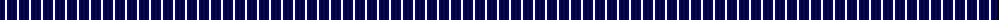
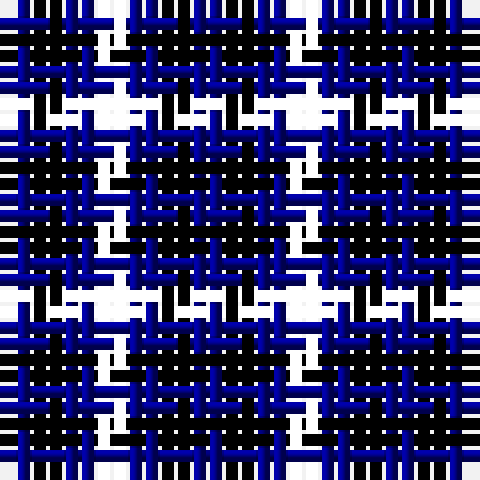

The parent of this is [Algarve (Fashion)](/tartans/db/2/k2/dba2/g/2/)

This was sourced from tartans-authority.  It is a [4 stripes tartan](/stripes/stripes4/).

Original link http://www.tartansauthority.com/tartan-ferret/display/4202/

## Thread count
DB/2 K2 DBa2 G/2

## Palette
Each colour and its ΔE from the base-6 reference it is a variant of.

| Colour | Shade | Base | ΔE (OKLab) |
|---|---|---|---|
| DB |  `#00008C` | B  | 0.13 |
| DBa |  `#00008C` | B  | 0.13 |
| K |  `#000000` | K  | 0.00 |

# Sample pattern

ID: /variants/db/2/k2/dba2/g/2-db00008c-dba00008c-k000000/
