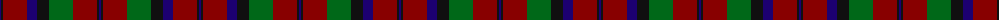

The parent of this is [Montrose (Macnaughton variation)](/tartans/db/2/k2/dr24/db10/k12/g24/dr24/k2/db/2/)

This was sourced from register-of-tartans.  It is a [9 stripes tartan](/stripes/stripes9/).

Original link https://www.tartanregister.gov.uk/tartanDetails.aspx?ref=2998

## Thread count
DB/2 K2 DR24 DB10 K12 G24 DR24 K2 DB/2

## Palette
Each colour and its ΔE from the base-6 reference it is a variant of.

| Colour | Shade | Base | ΔE (OKLab) |
|---|---|---|---|
| DB |  `#1C0070` | B  | 0.14 |
| DR |  `#880000` | R  | 0.14 |
| G |  `#006818` | G  | 0.02 |
| K |  `#101010` | K  | 0.17 |

ID: /variants/db/2/k2/dr24/db10/k12/g24/dr24/k2/db/2-db1c0070-dr880000-g006818-k101010/
