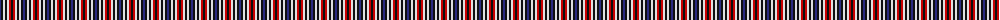
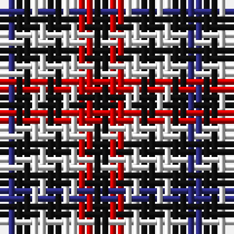

The parent of this is [Bell Southern Family Tartan Tartan Number: 370. Earliest known date: 1986 Originally anotated with 'Authorized by The Clan Bell of Lochmaben' but not now recognised by Chief Apparent, Benjamin. This tartan was known, possibly in error, as Bell of Blackethouse or Bell Blackethouse, and is now called 'Southern Bell'. See products available Copyright © Blair Urquhart, Comrie, 2015](/tartans/db/2/k2/ln2/k2/ln2/r2/k/2/)

This was sourced from house-of-tartan.  It is a [7 stripes tartan](/stripes/stripes7/).

Original link http://www.house-of-tartan.scotland.net/house/TartanViewjs.asp?colr=Def&tnam=370

## Thread count
DB/2 K2 LN2 K2 LN2 R2 K/2

## Palette
Each colour and its ΔE from the base-6 reference it is a variant of.

| Colour | Shade | Base | ΔE (OKLab) |
|---|---|---|---|
| DB |  `#2C2C80` | B  | 0.05 |
| K |  `#101010` | K  | 0.17 |
| LN |  `#E0E0E0` | W  | 0.06 |
| R |  `#C80000` | R  | 0.00 |

# Sample pattern

ID: /variants/db/2/k2/ln2/k2/ln2/r2/k/2-db2c2c80-k101010-lne0e0e0-rc80000/
