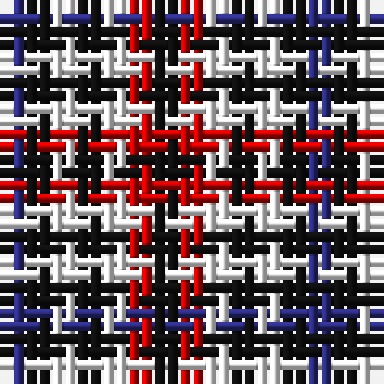

The parent of this is [Bell, Border (Name)](/tartans/db/2/k2/w2/k2/w2/r2/k/2/)

This was sourced from tartans-authority.  It is a [7 stripes tartan](/stripes/stripes7/).

Original link http://www.tartansauthority.com/tartan-ferret/display/370/

## Thread count
DB/2 K2 W2 K2 W2 R2 K/2

## Palette
Each colour and its ΔE from the base-6 reference it is a variant of.

| Colour | Shade | Base | ΔE (OKLab) |
|---|---|---|---|
| DB |  `#2C2C80` | B  | 0.05 |
| K |  `#101010` | K  | 0.17 |
| R |  `#C80000` | R  | 0.00 |
| W |  `#FCFCFC` | W  | 0.03 |

# Sample pattern

ID: /variants/db/2/k2/w2/k2/w2/r2/k/2-db2c2c80-k101010-rc80000-wfcfcfc/
