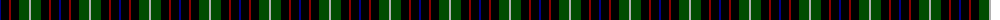
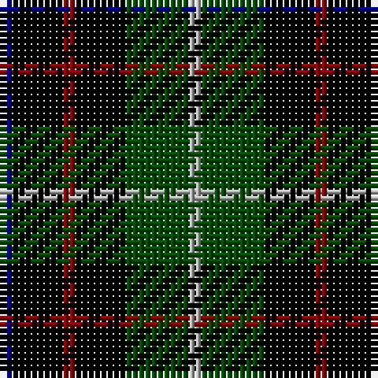

The parent of this is [Unidentified Dance](/tartans/db/2/k8/dr2/k8/g10/n/2/)

This was sourced from register-of-tartans.  It is a [6 stripes tartan](/stripes/stripes6/).

Original link https://www.tartanregister.gov.uk/tartanDetails.aspx?ref=4290

## Thread count
DB/2 K8 DR2 K8 G10 N/2

## Palette
Each colour and its ΔE from the base-6 reference it is a variant of.

| Colour | Shade | Base | ΔE (OKLab) |
|---|---|---|---|
| DB |  `#00008C` | B  | 0.13 |
| DR |  `#8C0000` | R  | 0.13 |
| G |  `#004C00` | G  | 0.08 |
| K |  `#000000` | K  | 0.00 |
| N |  `#B0B0B0` | Y  | 0.18 |

# Sample pattern

ID: /variants/db/2/k8/dr2/k8/g10/n/2-db00008c-dr8c0000-g004c00-k000000-nb0b0b0/
