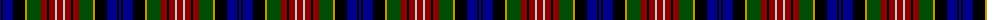

The parent of this is [Wcwm 1591](/tartans/db/2/ka2/db10/ka12/dy2/g14/dr6/ka2/dr6/n2/dr/6/)

This was sourced from register-of-tartans.  It is a [11 stripes tartan](/stripes/stripes11/).

Original link https://www.tartanregister.gov.uk/tartanDetails.aspx?ref=4536

## Thread count
DB/2 Ka2 DB10 Ka12 DY2 G14 DR6 Ka2 DR6 N2 DR/6

## Palette
Each colour and its ΔE from the base-6 reference it is a variant of.

| Colour | Shade | Base | ΔE (OKLab) |
|---|---|---|---|
| DB |  `#00008C` | B  | 0.13 |
| DR |  `#8C0000` | R  | 0.13 |
| DY |  `#C89800` | Y  | 0.12 |
| G |  `#004C00` | G  | 0.08 |
| K |  `#000000` | K  | 0.00 |
| Ka |  `#000000` | K  | 0.00 |
| N |  `#C8C8C8` | W  | 0.13 |

ID: /variants/db/2/ka2/db10/ka12/dy2/g14/dr6/ka2/dr6/n2/dr/6-db00008c-dr8c0000-dyc89800-g004c00-k000000-ka000000-nc8c8c8/
