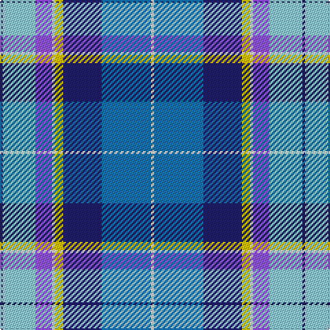

The parent of this is [Ancient Gathering](/tartans/db/2/lb24/p12/w2/y6/db28/b36/w/2/)

This was sourced from tartans-authority.  It is a [8 stripes tartan](/stripes/stripes8/).

Original link http://www.tartansauthority.com/tartan-ferret/display/11029/

## Thread count
DB/2 LB24 P12 W2 Y6 DB28 B36 W/2

## Palette
Each colour and its ΔE from the base-6 reference it is a variant of.

| Colour | Shade | Base | ΔE (OKLab) |
|---|---|---|---|
| B |  `#1870A4` | B  | 0.14 |
| DB |  `#202060` | B  | 0.11 |
| LB |  `#98C8E8` | W  | 0.17 |
| P |  `#9058D8` | B  | 0.22 |
| W |  `#FCFCFC` | W  | 0.03 |
| Y |  `#E8C000` | Y  | 0.00 |

# Sample pattern

ID: /variants/db/2/lb24/p12/w2/y6/db28/b36/w/2-b1870a4-db202060-lb98c8e8-p9058d8-wfcfcfc-ye8c000/
