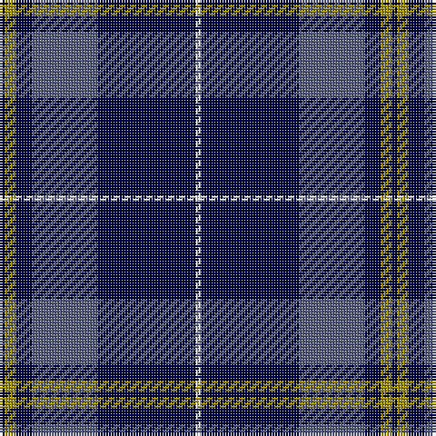

The parent of this is [Jon's Theme Fashion Tartan Tartan Number: 10642. Earliest known date: 17/04/2012 This tartan was created for Jon Pittard as a thank-you for helping the designer recover from two reconstructive surgeries, one in 2006 and one in 2007. See products available Copyright © Blair Urquhart, Comrie, 2015](/tartans/db/2/lg4/db6/n24/db36/w/2/)

This was sourced from house-of-tartan.  It is a [6 stripes tartan](/stripes/stripes6/).

Original link http://www.house-of-tartan.scotland.net/house/TartanViewjs.asp?colr=Def&tnam=10642

## Thread count
DB/2 LG4 DB6 N24 DB36 W/2

## Palette
Each colour and its ΔE from the base-6 reference it is a variant of.

| Colour | Shade | Base | ΔE (OKLab) |
|---|---|---|---|
| DB |  `#010542` | B  | 0.21 |
| LG |  `#9E8F00` | Y  | 0.18 |
| N |  `#555B7C` | B  | 0.11 |
| W |  `#FFFFFF` | W  | 0.03 |

# Sample pattern

ID: /variants/db/2/lg4/db6/n24/db36/w/2-db010542-lg9e8f00-n555b7c-wffffff/
