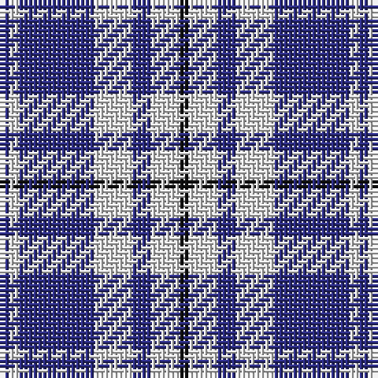

The parent of this is [Queen Margaret University (Corporate](/tartans/db/2/ln2/db16/ln8/db4/ln6/k/2/)

This was sourced from tartans-authority.  It is a [7 stripes tartan](/stripes/stripes7/).

Original link http://www.tartansauthority.com/tartan-ferret/display/7772/

## Thread count
DB/2 LN2 DB16 LN8 DB4 LN6 K/2

## Palette
Each colour and its ΔE from the base-6 reference it is a variant of.

| Colour | Shade | Base | ΔE (OKLab) |
|---|---|---|---|
| DB |  `#2C2C80` | B  | 0.05 |
| K |  `#101010` | K  | 0.17 |
| LN |  `#E0E0E0` | W  | 0.06 |

# Sample pattern

ID: /variants/db/2/ln2/db16/ln8/db4/ln6/k/2-db2c2c80-k101010-lne0e0e0/
