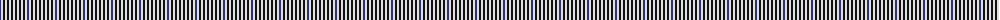
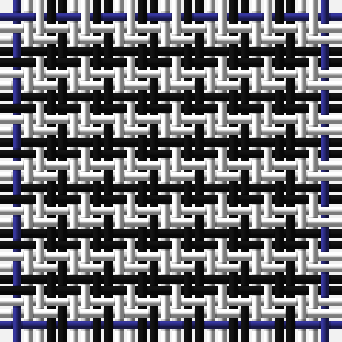

The parent of this is [Buccleuch Check Regimental Tartan Tartan Number: 647. Earliest known date: 1908 Designed by the Colonel of the 4th Battalion Kings Own Scottish Borderers in 1908 and used for the pipers' plaids. Originally woven by Ballantynes of Walkerburn. Earl Haig's family adopted it since he was also a Colonel of the battalion.This - according to J Cant - is the correct version of the Buccleuch check with nine black squares between the blue. The black and white squares measure 5/16 inch and the blue 3/8 inch (about 2 threads more?). Sample in STA Dalgety Collection has 8 black squares between the blue lines and label saying woven by Ballantynes of Walkerburn. See products available Copyright © Blair Urquhart, Comrie, 2015](/tartans/db/2/ln2/k2/ln2/k2/ln2/k2/ln/2/)

This was sourced from house-of-tartan.  It is a [8 stripes tartan](/stripes/stripes8/).

Original link http://www.house-of-tartan.scotland.net/house/TartanViewjs.asp?colr=Def&tnam=647

## Thread count
DB/2 LN2 K2 LN2 K2 LN2 K2 LN/2

## Palette
Each colour and its ΔE from the base-6 reference it is a variant of.

| Colour | Shade | Base | ΔE (OKLab) |
|---|---|---|---|
| DB |  `#2C2C80` | B  | 0.05 |
| K |  `#101010` | K  | 0.17 |
| LN |  `#E0E0E0` | W  | 0.06 |

# Sample pattern

ID: /variants/db/2/ln2/k2/ln2/k2/ln2/k2/ln/2-db2c2c80-k101010-lne0e0e0/
