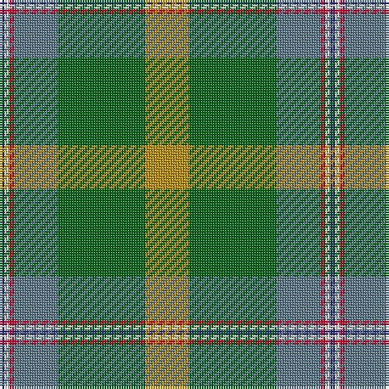

The parent of this is [T.H.E. C.O.G. USA (Corporate)](/tartans/db/2/ln2/r2/b18/g36/dy/18/)

This was sourced from tartans-authority.  It is a [6 stripes tartan](/stripes/stripes6/).

Original link http://www.tartansauthority.com/tartan-ferret/display/10286/

## Thread count
DB/2 LN2 R2 B18 G36 DY/18

## Palette
Each colour and its ΔE from the base-6 reference it is a variant of.

| Colour | Shade | Base | ΔE (OKLab) |
|---|---|---|---|
| B |  `#5C7888` | B  | 0.18 |
| DB |  `#2C2C80` | B  | 0.05 |
| DY |  `#BC8C00` | Y  | 0.16 |
| G |  `#006818` | G  | 0.02 |
| LN |  `#E0E0E0` | W  | 0.06 |
| R |  `#C8002C` | R  | 0.03 |

# Sample pattern

ID: /variants/db/2/ln2/r2/b18/g36/dy/18-b5c7888-db2c2c80-dybc8c00-g006818-lne0e0e0-rc8002c/
