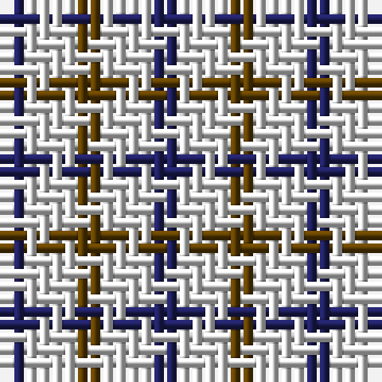

The parent of this is [Aquascutum](/tartans/db/2/ln4/t/2/)

This was sourced from register-of-tartans.  It is a [3 stripes tartan](/stripes/stripes3/).

Original link https://www.tartanregister.gov.uk/tartanDetails.aspx?ref=103

## Thread count
DB/2 LN4 T/2

## Palette
Each colour and its ΔE from the base-6 reference it is a variant of.

| Colour | Shade | Base | ΔE (OKLab) |
|---|---|---|---|
| DB |  `#202060` | B  | 0.11 |
| LN |  `#E0E0E0` | W  | 0.06 |
| T |  `#604000` | G  | 0.14 |

# Sample pattern

ID: /variants/db/2/ln4/t/2-db202060-lne0e0e0-t604000/
