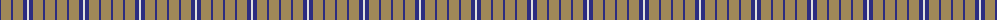
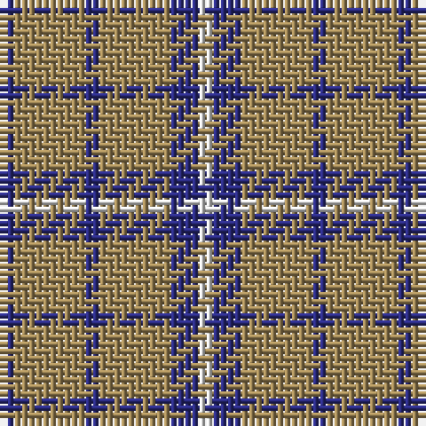

The parent of this is [Tokharion](/tartans/db/2/lt10/db2/lt10/db4/ln/2/)

This was sourced from register-of-tartans.  It is a [6 stripes tartan](/stripes/stripes6/).

Original link https://www.tartanregister.gov.uk/tartanDetails.aspx?ref=4133

## Thread count
DB/2 LT10 DB2 LT10 DB4 LN/2

## Palette
Each colour and its ΔE from the base-6 reference it is a variant of.

| Colour | Shade | Base | ΔE (OKLab) |
|---|---|---|---|
| DB |  `#2C2C80` | B  | 0.05 |
| LN |  `#E0E0E0` | W  | 0.06 |
| LT |  `#A08858` | Y  | 0.21 |

# Sample pattern

ID: /variants/db/2/lt10/db2/lt10/db4/ln/2-db2c2c80-lne0e0e0-lta08858/
