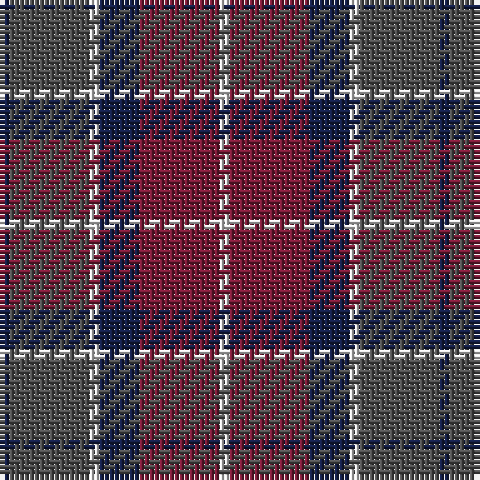

The parent of this is [Little's Chauffeur Drive](/tartans/db/2/n16/ln2/db8/dr16/ln/2/)

This was sourced from register-of-tartans.  It is a [6 stripes tartan](/stripes/stripes6/).

Original link https://www.tartanregister.gov.uk/tartanDetails.aspx?ref=5905

## Thread count
DB/2 N16 LN2 DB8 DR16 LN/2

## Palette
Each colour and its ΔE from the base-6 reference it is a variant of.

| Colour | Shade | Base | ΔE (OKLab) |
|---|---|---|---|
| DB |  `#141E46` | B  | 0.15 |
| DR |  `#781C38` | R  | 0.17 |
| LN |  `#E0E0E0` | W  | 0.06 |
| N |  `#505050` | B  | 0.12 |

# Sample pattern

ID: /variants/db/2/n16/ln2/db8/dr16/ln/2-db141e46-dr781c38-lne0e0e0-n505050/
