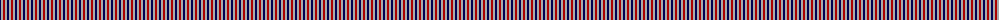
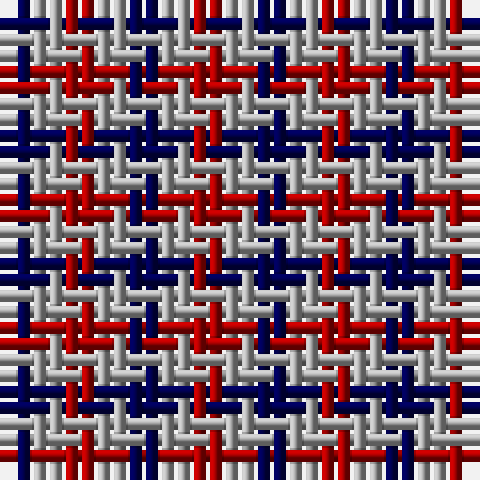

The parent of this is [Usa](/tartans/db/2/n2/dr/2/)

This was sourced from weddslist.  It is a [3 stripes tartan](/stripes/stripes3/).

Original link http://www.weddslist.com/cgi-bin/tartans/pg.pl?source=x

## Thread count
DB/2 N2 DR/2

## Palette
Each colour and its ΔE from the base-6 reference it is a variant of.

| Colour | Shade | Base | ΔE (OKLab) |
|---|---|---|---|
| DB |  `#000052` | B  | 0.20 |
| DR |  `#AA0000` | R  | 0.06 |
| LG |  `#AAAA00` | Y  | 0.11 |
| N |  `#AAAAAA` | Y  | 0.19 |

# Sample pattern

ID: /variants/db/2/n2/dr/2-db000052-draa0000-lgaaaa00-naaaaaa/
