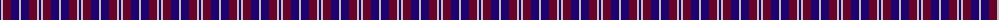
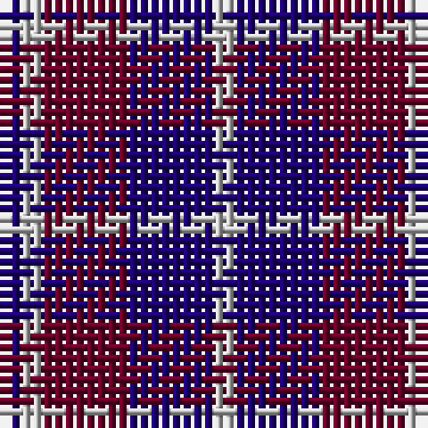

The parent of this is [Laval, Tartan de (District)](/tartans/db/2/n2/dr8/db8/n/2/)

This was sourced from tartans-authority.  It is a [5 stripes tartan](/stripes/stripes5/).

Original link http://www.tartansauthority.com/tartan-ferret/display/2120/

## Thread count
DB/2 N2 DR8 DB8 N/2

## Palette
Each colour and its ΔE from the base-6 reference it is a variant of.

| Colour | Shade | Base | ΔE (OKLab) |
|---|---|---|---|
| DB |  `#1C0070` | B  | 0.14 |
| DR |  `#680028` | B  | 0.20 |
| N |  `#C0C0C0` | W  | 0.16 |

# Sample pattern

ID: /variants/db/2/n2/dr8/db8/n/2-db1c0070-dr680028-nc0c0c0/
