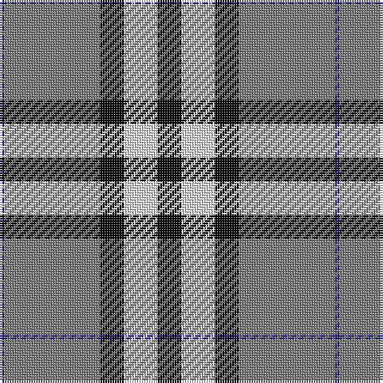

The parent of this is [Burberry, Grey (Original) (Fashion)](/tartans/db/2/n40/k10/ln14/k/10/)

This was sourced from tartans-authority.  It is a [5 stripes tartan](/stripes/stripes5/).

Original link http://www.tartansauthority.com/tartan-ferret/display/7268/

## Thread count
DB/2 N40 K10 LN14 K/10

## Palette
Each colour and its ΔE from the base-6 reference it is a variant of.

| Colour | Shade | Base | ΔE (OKLab) |
|---|---|---|---|
| DB |  `#2C2C80` | B  | 0.05 |
| K |  `#101010` | K  | 0.17 |
| LN |  `#E0E0E0` | W  | 0.06 |
| N |  `#7C7C7C` | G  | 0.21 |

# Sample pattern

ID: /variants/db/2/n40/k10/ln14/k/10-db2c2c80-k101010-lne0e0e0-n7c7c7c/
