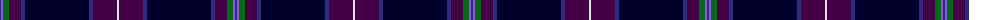

The parent of this is [Scottish Heather (Fashion)](/tartans/db/2/p2/g6/dp12/db4/dba64/db4/dp24/ln/2/)

This was sourced from tartans-authority.  It is a [9 stripes tartan](/stripes/stripes9/).

Original link http://www.tartansauthority.com/tartan-ferret/display/3909/

## Thread count
DB/2 P2 G6 DP12 DB4 DBa64 DB4 DP24 LN/2

## Palette
Each colour and its ΔE from the base-6 reference it is a variant of.

| Colour | Shade | Base | ΔE (OKLab) |
|---|---|---|---|
| DB |  `#2C2C80` | B  | 0.05 |
| DBa |  `#00002C` | K  | 0.16 |
| DP |  `#440044` | B  | 0.17 |
| G |  `#006818` | G  | 0.02 |
| LN |  `#E0E0E0` | W  | 0.06 |
| P |  `#9058D8` | B  | 0.22 |

ID: /variants/db/2/p2/g6/dp12/db4/dba64/db4/dp24/ln/2-db2c2c80-dba00002c-dp440044-g006818-lne0e0e0-p9058d8/
