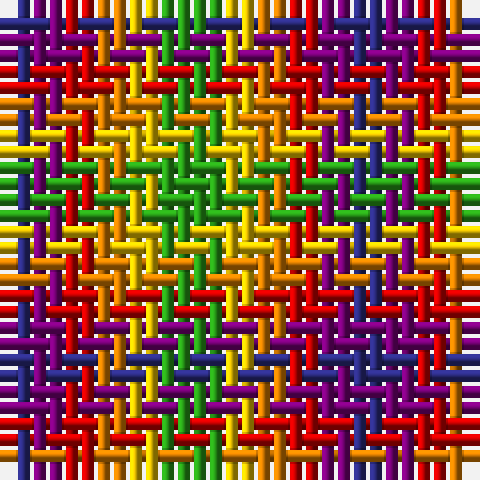

The parent of this is [Rainbow (Fashion)](/tartans/db/2/p2/r2/o2/y2/g/4/)

This was sourced from tartans-authority.  It is a [6 stripes tartan](/stripes/stripes6/).

Original link http://www.tartansauthority.com/tartan-ferret/display/2647/

## Thread count
DB/2 P2 R2 O2 Y2 G/4

## Palette
Each colour and its ΔE from the base-6 reference it is a variant of.

| Colour | Shade | Base | ΔE (OKLab) |
|---|---|---|---|
| DB |  `#2C2C80` | B  | 0.05 |
| G |  `#289C18` | G  | 0.18 |
| O |  `#D87C00` | Y  | 0.17 |
| P |  `#780078` | B  | 0.16 |
| R |  `#C80000` | R  | 0.00 |
| Y |  `#E8C000` | Y  | 0.00 |

# Sample pattern

ID: /variants/db/2/p2/r2/o2/y2/g/4-db2c2c80-g289c18-od87c00-p780078-rc80000-ye8c000/
