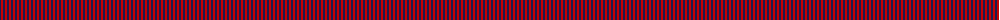
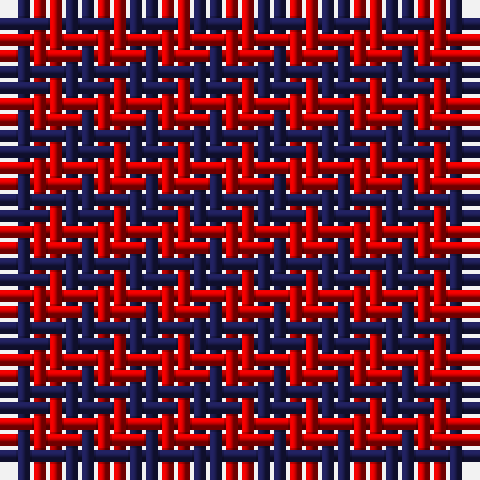

The parent of this is [Dice (Name?)](/tartans/db/2/r/2/)

This was sourced from tartans-authority.  It is a [2 stripes tartan](/stripes/stripes2/).

Original link http://www.tartansauthority.com/tartan-ferret/display/8114/

## Thread count
DB/2 R/2

## Palette
Each colour and its ΔE from the base-6 reference it is a variant of.

| Colour | Shade | Base | ΔE (OKLab) |
|---|---|---|---|
| DB |  `#1C1C50` | B  | 0.14 |
| R |  `#C80000` | R  | 0.00 |

# Sample pattern

ID: /variants/db/2/r/2-db1c1c50-rc80000/
