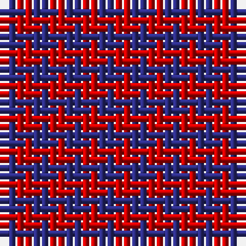

The parent of this is [Masai Shuka 02 (Artefact)](/tartans/db/2/r/2/)

This was sourced from tartans-authority.  It is a [2 stripes tartan](/stripes/stripes2/).

Original link http://www.tartansauthority.com/tartan-ferret/display/7189/

## Thread count
DB/2 R/2

## Palette
DB R

# Sample pattern

ID: /variants/db/2/r/2-db2c2c80-rc80000/
