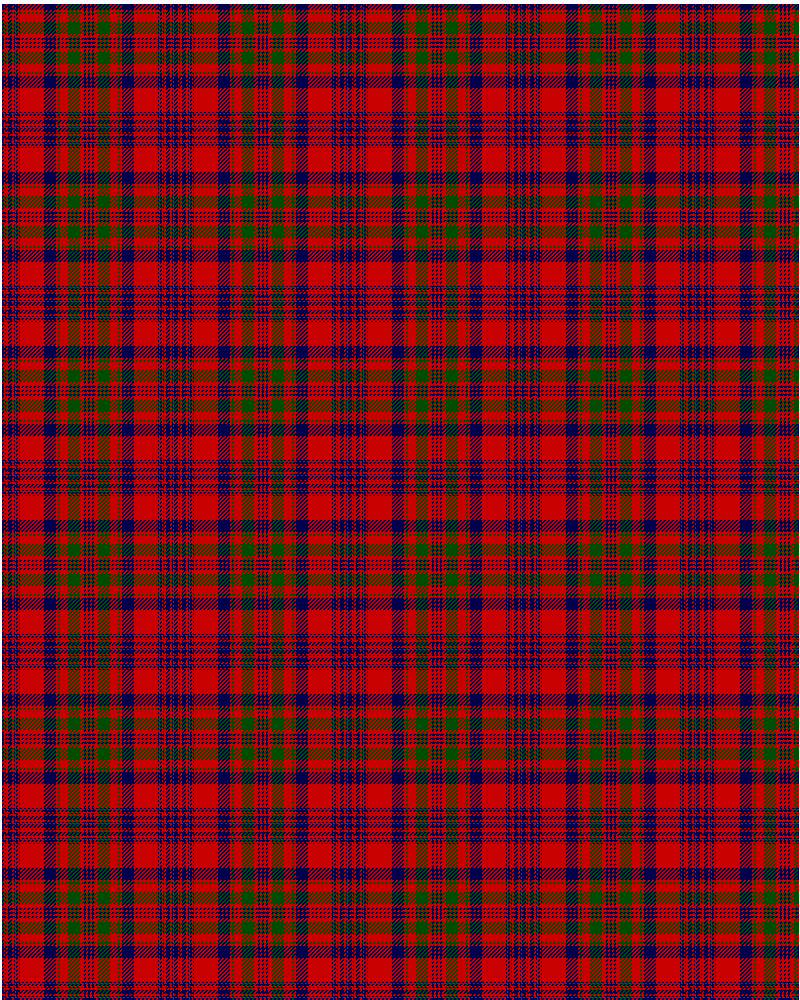

Murray of Tullibardine

This was sourced from <no value>.  It is a 21 stripes tartan.

Original link http://www.weddslist.com/cgi-bin/tartans/pg.pl?source=rb

## Thread count
DB/2 R1 DB1 R2 DB4 R2 DB1 R1 DB2 R1 DB1 R24 DB12 R2 G2 R8 G12 R4 DB2 R2 DB/1

## Palette
DB#00004C G#004C00 R#C80000

# Sample pattern

ID: /variants/db/2/r1/db1/r2/db4/r2/db1/r1/db2/r1/db1/r24/db12/r2/g2/r8/g12/r4/db2/r2/db/1-db00004c-g004c00-rc80000