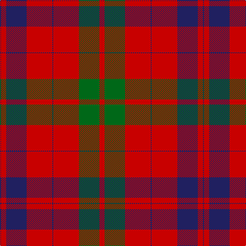

The parent of this is [Franklin Museum Unidentified 2](/tartans/db/2/r10/db40/r50/db2/r50/g40/r/10/)

This was sourced from register-of-tartans.  It is a [8 stripes tartan](/stripes/stripes8/).

Original link https://www.tartanregister.gov.uk/tartanDetails.aspx?ref=4974

## Thread count
DB/2 R10 DB40 R50 DB2 R50 G40 R/10

## Palette
Each colour and its ΔE from the base-6 reference it is a variant of.

| Colour | Shade | Base | ΔE (OKLab) |
|---|---|---|---|
| DB |  `#202060` | B  | 0.11 |
| G |  `#006818` | G  | 0.02 |
| R |  `#C80000` | R  | 0.00 |

# Sample pattern

ID: /variants/db/2/r10/db40/r50/db2/r50/g40/r/10-db202060-g006818-rc80000/
