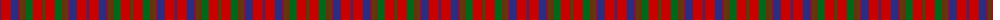

The parent of this is [Lumsden of Kintore Tartan Tartan Number: 418. Earliest known date: 1797 Made at Boghead of Kintore. See products available Copyright © Blair Urquhart, Comrie, 2015](/tartans/db/2/r10/db8/r2/g2/r2/g8/r10/g/2/)

This was sourced from house-of-tartan.  It is a [9 stripes tartan](/stripes/stripes9/).

Original link http://www.house-of-tartan.scotland.net/house/TartanViewjs.asp?colr=Def&tnam=418

## Thread count
DB/2 R10 DB8 R2 G2 R2 G8 R10 G/2

## Palette
Each colour and its ΔE from the base-6 reference it is a variant of.

| Colour | Shade | Base | ΔE (OKLab) |
|---|---|---|---|
| DB |  `#2C2C80` | B  | 0.05 |
| G |  `#006818` | G  | 0.02 |
| R |  `#C80000` | R  | 0.00 |

ID: /variants/db/2/r10/db8/r2/g2/r2/g8/r10/g/2-db2c2c80-g006818-rc80000/
