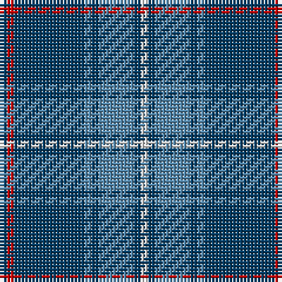

The parent of this is [A2 (Personal)](/tartans/db/2/r2/db20/b2/db2/b10/db2/ln/2/)

This was sourced from tartans-authority.  It is a [8 stripes tartan](/stripes/stripes8/).

Original link http://www.tartansauthority.com/tartan-ferret/display/7722/

## Thread count
DB/2 R2 DB20 B2 DB2 B10 DB2 LN/2

## Palette
Each colour and its ΔE from the base-6 reference it is a variant of.

| Colour | Shade | Base | ΔE (OKLab) |
|---|---|---|---|
| B |  `#5488AC` | B  | 0.22 |
| DB |  `#003C64` | B  | 0.07 |
| LN |  `#E0E0E0` | W  | 0.06 |
| R |  `#C80000` | R  | 0.00 |

# Sample pattern

ID: /variants/db/2/r2/db20/b2/db2/b10/db2/ln/2-b5488ac-db003c64-lne0e0e0-rc80000/
