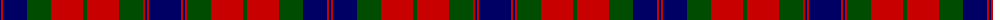

The parent of this is [Fraser](/tartans/db/2/r2/db24/g24/r32/g4/r32/g24/r2/db2/r2/db/32/)

This was sourced from weddslist.  It is a [12 stripes tartan](/stripes/stripes12/).

Original link http://www.weddslist.com/cgi-bin/tartans/pg.pl?source=rb

## Thread count
DB/2 R2 DB24 G24 R32 G4 R32 G24 R2 DB2 R2 DB/32

## Palette
Each colour and its ΔE from the base-6 reference it is a variant of.

| Colour | Shade | Base | ΔE (OKLab) |
|---|---|---|---|
| DB |  `#000064` | B  | 0.17 |
| G |  `#004C00` | G  | 0.08 |
| R |  `#C80000` | R  | 0.00 |

ID: /variants/db/2/r2/db24/g24/r32/g4/r32/g24/r2/db2/r2/db/32-db000064-g004c00-rc80000/
