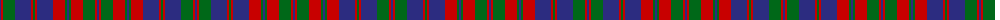

The parent of this is [Crieff Hydro Hotel (Corporate)](/tartans/db/2/r2/g12/db16/r2/g2/r2/db16/r12/g2/db2/g2/r12/g12/r2/db/2/)

This was sourced from tartans-authority.  It is a [16 stripes tartan](/stripes/stripes16/).

Original link http://www.tartansauthority.com/tartan-ferret/display/5166/

## Thread count
DB/2 R2 G12 DB16 R2 G2 R2 DB16 R12 G2 DB2 G2 R12 G12 R2 DB/2

## Palette
Each colour and its ΔE from the base-6 reference it is a variant of.

| Colour | Shade | Base | ΔE (OKLab) |
|---|---|---|---|
| DB |  `#2C2C80` | B  | 0.05 |
| G |  `#006818` | G  | 0.02 |
| R |  `#C80000` | R  | 0.00 |

ID: /variants/db/2/r2/g12/db16/r2/g2/r2/db16/r12/g2/db2/g2/r12/g12/r2/db/2-db2c2c80-g006818-rc80000/
