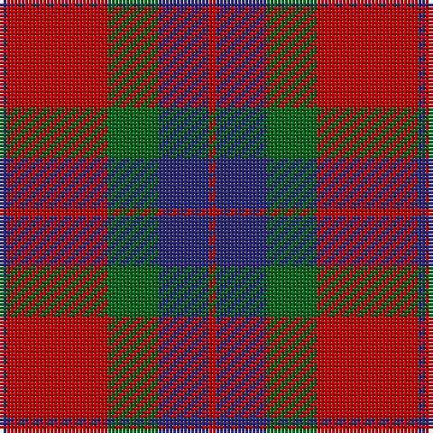

The parent of this is [Fraser of Boblainy, Hugh (Personal)](/tartans/db/2/r28/g14/db14/r/2/)

This was sourced from tartans-authority.  It is a [5 stripes tartan](/stripes/stripes5/).

Original link http://www.tartansauthority.com/tartan-ferret/display/2528/

## Thread count
DB/2 R28 G14 DB14 R/2

## Palette
Each colour and its ΔE from the base-6 reference it is a variant of.

| Colour | Shade | Base | ΔE (OKLab) |
|---|---|---|---|
| DB |  `#2C2C80` | B  | 0.05 |
| G |  `#006818` | G  | 0.02 |
| R |  `#C80000` | R  | 0.00 |

# Sample pattern

ID: /variants/db/2/r28/g14/db14/r/2-db2c2c80-g006818-rc80000/
