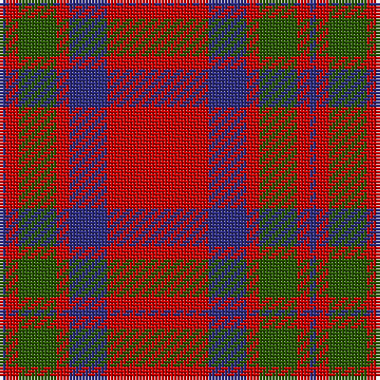

The parent of this is [MacKintosh Plaid](/tartans/db/2/r4/g12/r4/db12/r/32/)

This was sourced from register-of-tartans.  It is a [6 stripes tartan](/stripes/stripes6/).

Original link https://www.tartanregister.gov.uk/tartanDetails.aspx?ref=2575

## Thread count
DB/2 R4 G12 R4 DB12 R/32

## Palette
Each colour and its ΔE from the base-6 reference it is a variant of.

| Colour | Shade | Base | ΔE (OKLab) |
|---|---|---|---|
| DB |  `#2C2C80` | B  | 0.05 |
| G |  `#285800` | G  | 0.04 |
| R |  `#C80000` | R  | 0.00 |

# Sample pattern

ID: /variants/db/2/r4/g12/r4/db12/r/32-db2c2c80-g285800-rc80000/
