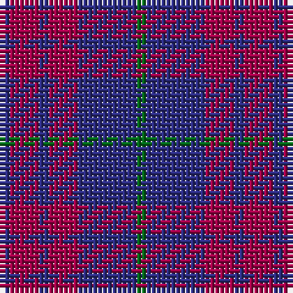

The parent of this is [Robbins Family Tartan Tartan Number: 412. Earliest known date: 1985 See products available Copyright © Blair Urquhart, Comrie, 2015](/tartans/db/2/r6/db2/r6/db12/g/2/)

This was sourced from house-of-tartan.  It is a [6 stripes tartan](/stripes/stripes6/).

Original link http://www.house-of-tartan.scotland.net/house/TartanViewjs.asp?colr=Def&tnam=412

## Thread count
DB/2 R6 DB2 R6 DB12 G/2

## Palette
Each colour and its ΔE from the base-6 reference it is a variant of.

| Colour | Shade | Base | ΔE (OKLab) |
|---|---|---|---|
| DB |  `#2C2C80` | B  | 0.05 |
| G |  `#006818` | G  | 0.02 |
| R |  `#A00048` | R  | 0.11 |

# Sample pattern

ID: /variants/db/2/r6/db2/r6/db12/g/2-db2c2c80-g006818-ra00048/
