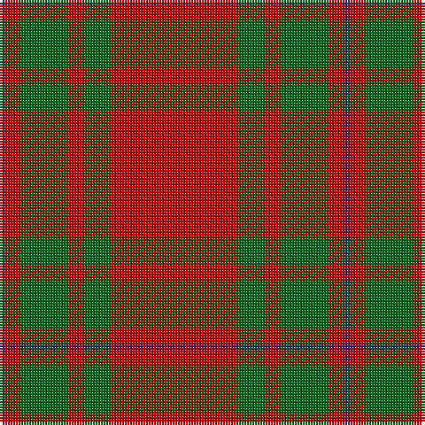

The parent of this is [MacKintosh, Red Clan/Family Tartan Tartan Number: 5889. Earliest known date: 1951 This is the count for Red MacKintosh as decided by Lord Lyon and sent to Vice Admiral The Mackintosh of Mackintosh on 20th March 1951. It differs from No.521 (MacKintosh Clan) in that here the narrow bands outwith the broad green bands are also green: in No.521 they are blue. Lyon and Mr Kinloch Anderson had readjusted the setts of this and the Hunting tartan to correct discrepancies which they believed to have crept in over the years. It is generally regarded that the Chief of the Clan is the final arbiter of the sett of the Clan tartan, rather than the Lord Lyon. See products available Copyright © Blair Urquhart, Comrie, 2015](/tartans/db/2/r6/g18/r6/g10/r/48/)

This was sourced from house-of-tartan.  It is a [6 stripes tartan](/stripes/stripes6/).

Original link http://www.house-of-tartan.scotland.net/house/TartanViewjs.asp?colr=Def&tnam=5889

## Thread count
DB/2 R6 G18 R6 G10 R/48

## Palette
Each colour and its ΔE from the base-6 reference it is a variant of.

| Colour | Shade | Base | ΔE (OKLab) |
|---|---|---|---|
| DB |  `#2C2C80` | B  | 0.05 |
| G |  `#006818` | G  | 0.02 |
| R |  `#C80000` | R  | 0.00 |

# Sample pattern

ID: /variants/db/2/r6/g18/r6/g10/r/48-db2c2c80-g006818-rc80000/
