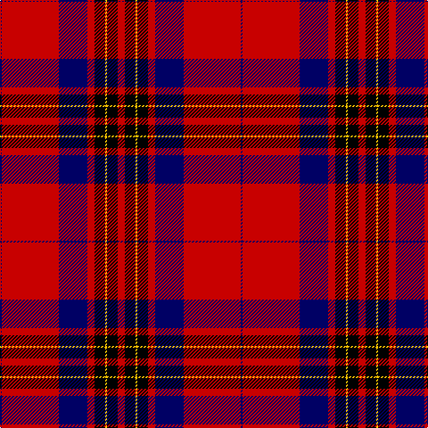

The parent of this is [Leslie Dress](/tartans/db/2/r64/db32/r8/k12/y2/k12/r/8/)

This was sourced from weddslist.  It is a [8 stripes tartan](/stripes/stripes8/).

Original link http://www.weddslist.com/cgi-bin/tartans/pg.pl?source=rb

## Thread count
DB/2 R64 DB32 R8 K12 Y2 K12 R/8

## Palette
Each colour and its ΔE from the base-6 reference it is a variant of.

| Colour | Shade | Base | ΔE (OKLab) |
|---|---|---|---|
| DB |  `#000064` | B  | 0.17 |
| K |  `#000000` | K  | 0.00 |
| R |  `#C80000` | R  | 0.00 |
| Y |  `#FFC800` | Y  | 0.04 |

# Sample pattern

ID: /variants/db/2/r64/db32/r8/k12/y2/k12/r/8-db000064-k000000-rc80000-yffc800/
