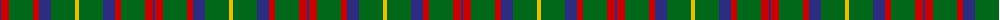

The parent of this is [MacKintosh Htg (Clan)](/tartans/db/2/r8/g24/r6/db12/g24/y/4/)

This was sourced from tartans-authority.  It is a [7 stripes tartan](/stripes/stripes7/).

Original link http://www.tartansauthority.com/tartan-ferret/display/544/

## Thread count
DB/2 R8 G24 R6 DB12 G24 Y/4

## Palette
Each colour and its ΔE from the base-6 reference it is a variant of.

| Colour | Shade | Base | ΔE (OKLab) |
|---|---|---|---|
| DB |  `#2C2C80` | B  | 0.05 |
| G |  `#006818` | G  | 0.02 |
| R |  `#C80000` | R  | 0.00 |
| Y |  `#E8C000` | Y  | 0.00 |

# Sample pattern

ID: /variants/db/2/r8/g24/r6/db12/g24/y/4-db2c2c80-g006818-rc80000-ye8c000/
