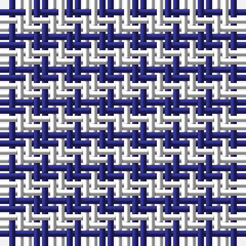

The parent of this is [Sillitoe](/tartans/db/2/w/2/)

This was sourced from register-of-tartans.  It is a [2 stripes tartan](/stripes/stripes2/).

Original link https://www.tartanregister.gov.uk/tartanDetails.aspx?ref=3786

## Thread count
DB/2 W/2

## Palette
DB K W

# Sample pattern

ID: /variants/db/2/w/2-db2c2c80-k101010-wf8f8f8/
