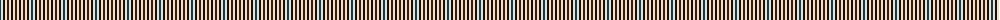

The parent of this is [Strathspey (Estate Check)](/tartans/db/2/w2/k2/w2/dr2/w2/k2/w2/dr/2/)

This was sourced from tartans-authority.  It is a [9 stripes tartan](/stripes/stripes9/).

Original link http://www.tartansauthority.com/tartan-ferret/display/3226/

## Thread count
DB/2 W2 K2 W2 DR2 W2 K2 W2 DR/2

## Palette
Each colour and its ΔE from the base-6 reference it is a variant of.

| Colour | Shade | Base | ΔE (OKLab) |
|---|---|---|---|
| DB |  `#003C64` | B  | 0.07 |
| DR |  `#441800` | B  | 0.22 |
| K |  `#101010` | K  | 0.17 |
| W |  `#F0E0C4` | W  | 0.06 |

ID: /variants/db/2/w2/k2/w2/dr2/w2/k2/w2/dr/2-db003c64-dr441800-k101010-wf0e0c4/
