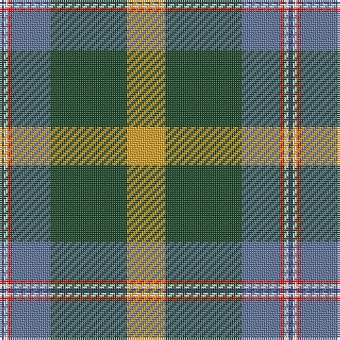

The parent of this is [COG USA, THE](/tartans/db/2/w2/r2/b18/dg36/y/18/)

This was sourced from register-of-tartans.  It is a [6 stripes tartan](/stripes/stripes6/).

Original link https://www.tartanregister.gov.uk/tartanDetails.aspx?ref=10286

## Thread count
DB/2 W2 R2 B18 DG36 Y/18

## Palette
Each colour and its ΔE from the base-6 reference it is a variant of.

| Colour | Shade | Base | ΔE (OKLab) |
|---|---|---|---|
| B |  `#5F749C` | B  | 0.17 |
| DB |  `#373875` | B  | 0.03 |
| DG |  `#1E492B` | G  | 0.11 |
| R |  `#CA2625` | R  | 0.03 |
| W |  `#F9F5EF` | W  | 0.01 |
| Y |  `#E0A126` | Y  | 0.08 |

# Sample pattern

ID: /variants/db/2/w2/r2/b18/dg36/y/18-b5f749c-db373875-dg1e492b-rca2625-wf9f5ef-ye0a126/
