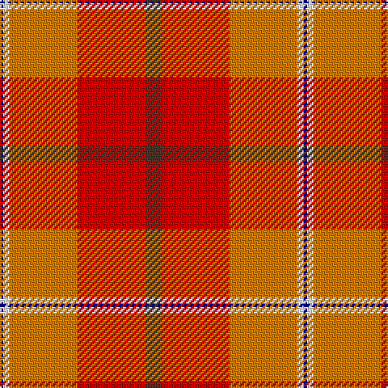

The parent of this is [Haughey (2015)](/tartans/db/2/w4/o42/r42/t/10/)

This was sourced from register-of-tartans.  It is a [5 stripes tartan](/stripes/stripes5/).

Original link https://www.tartanregister.gov.uk/tartanDetails.aspx?ref=11390

## Thread count
DB/2 W4 O42 R42 T/10

## Palette
Each colour and its ΔE from the base-6 reference it is a variant of.

| Colour | Shade | Base | ΔE (OKLab) |
|---|---|---|---|
| DB |  `#000080` | B  | 0.14 |
| O |  `#D87C00` | Y  | 0.17 |
| R |  `#DC0000` | R  | 0.04 |
| T |  `#4C3428` | B  | 0.16 |
| W |  `#F8F8F8` | W  | 0.01 |

# Sample pattern

ID: /variants/db/2/w4/o42/r42/t/10-db000080-od87c00-rdc0000-t4c3428-wf8f8f8/
