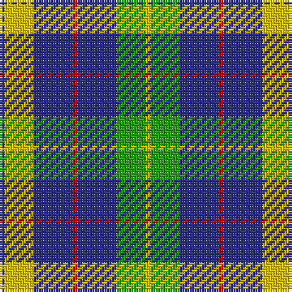

The parent of this is [Hill of Banchory Primary (School)](/tartans/db/2/y12/db16/r2/db16/g12/y/2/)

This was sourced from tartans-authority.  It is a [7 stripes tartan](/stripes/stripes7/).

Original link http://www.tartansauthority.com/tartan-ferret/display/7659/

## Thread count
DB/2 Y12 DB16 R2 DB16 G12 Y/2

## Palette
Each colour and its ΔE from the base-6 reference it is a variant of.

| Colour | Shade | Base | ΔE (OKLab) |
|---|---|---|---|
| DB |  `#2C2C80` | B  | 0.05 |
| G |  `#289C18` | G  | 0.18 |
| R |  `#C80000` | R  | 0.00 |
| Y |  `#E8C000` | Y  | 0.00 |

# Sample pattern

ID: /variants/db/2/y12/db16/r2/db16/g12/y/2-db2c2c80-g289c18-rc80000-ye8c000/
