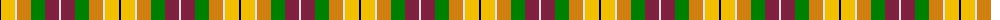

The parent of this is [Kipp](/tartans/db/2/y14/ln2/o14/g14/dr14/ln/2/)

This was sourced from weddslist.  It is a [7 stripes tartan](/stripes/stripes7/).

Original link http://www.weddslist.com/cgi-bin/tartans/pg.pl?source=sts

## Thread count
DB/2 Y14 LN2 O14 G14 DR14 LN/2

## Palette
Each colour and its ΔE from the base-6 reference it is a variant of.

| Colour | Shade | Base | ΔE (OKLab) |
|---|---|---|---|
| DB |  `#000050` | B  | 0.20 |
| DR |  `#802040` | R  | 0.16 |
| G |  `#008000` | G  | 0.09 |
| LN |  `#E0E0E0` | W  | 0.06 |
| O |  `#D08010` | Y  | 0.17 |
| Y |  `#F0C000` | Y  | 0.01 |

# Sample pattern

ID: /variants/db/2/y14/ln2/o14/g14/dr14/ln/2-db000050-dr802040-g008000-lne0e0e0-od08010-yf0c000/
