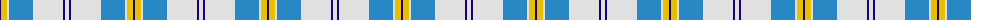
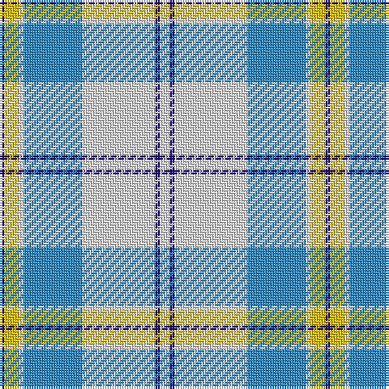

The parent of this is [St. John's (Corporate)](/tartans/db/2/y6/ln2/b24/ln30/db2/ln/4/)

This was sourced from tartans-authority.  It is a [7 stripes tartan](/stripes/stripes7/).

Original link http://www.tartansauthority.com/tartan-ferret/display/5787/

## Thread count
DB/2 Y6 LN2 B24 LN30 DB2 LN/4

## Palette
Each colour and its ΔE from the base-6 reference it is a variant of.

| Colour | Shade | Base | ΔE (OKLab) |
|---|---|---|---|
| B |  `#2888C4` | B  | 0.21 |
| DB |  `#1C0070` | B  | 0.14 |
| LN |  `#E0E0E0` | W  | 0.06 |
| Y |  `#E8C000` | Y  | 0.00 |

# Sample pattern

ID: /variants/db/2/y6/ln2/b24/ln30/db2/ln/4-b2888c4-db1c0070-lne0e0e0-ye8c000/
