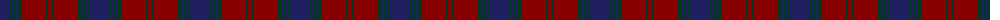

The parent of this is [Lawlis/Lawless (Name)](/tartans/db/20/dg2/db2/dg2/db2/dg4/dr24/dg2/dr/4/)

This was sourced from tartans-authority.  It is a [9 stripes tartan](/stripes/stripes9/).

Original link http://www.tartansauthority.com/tartan-ferret/display/5399/

## Thread count
DB/20 DG2 DB2 DG2 DB2 DG4 DR24 DG2 DR/4

## Palette
Each colour and its ΔE from the base-6 reference it is a variant of.

| Colour | Shade | Base | ΔE (OKLab) |
|---|---|---|---|
| DB |  `#202060` | B  | 0.11 |
| DG |  `#003820` | G  | 0.16 |
| DR |  `#880000` | R  | 0.14 |

ID: /variants/db/20/dg2/db2/dg2/db2/dg4/dr24/dg2/dr/4-db202060-dg003820-dr880000/
