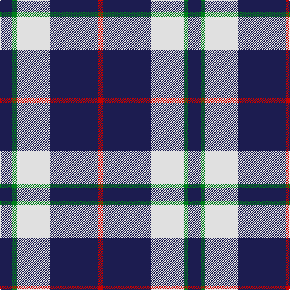

The parent of this is [Turnbull Dress, Bruce (Personal)](/tartans/db/20/g8/ln54/db80/r/8/)

This was sourced from tartans-authority.  It is a [5 stripes tartan](/stripes/stripes5/).

Original link http://www.tartansauthority.com/tartan-ferret/display/7398/

## Thread count
DB/20 G8 LN54 DB80 R/8

## Palette
Each colour and its ΔE from the base-6 reference it is a variant of.

| Colour | Shade | Base | ΔE (OKLab) |
|---|---|---|---|
| DB |  `#1C1C50` | B  | 0.14 |
| G |  `#00801C` | G  | 0.09 |
| LN |  `#E0E0E0` | W  | 0.06 |
| R |  `#C80000` | R  | 0.00 |

# Sample pattern

ID: /variants/db/20/g8/ln54/db80/r/8-db1c1c50-g00801c-lne0e0e0-rc80000/
