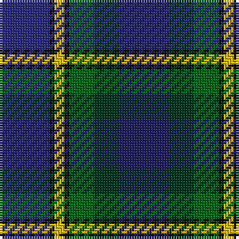

The parent of this is [Lenaghan (Personal)](/tartans/db/20/k2/y4/k2/g10/dg10/dba/20/)

This was sourced from tartans-authority.  It is a [7 stripes tartan](/stripes/stripes7/).

Original link http://www.tartansauthority.com/tartan-ferret/display/5835/

## Thread count
DB/20 K2 Y4 K2 G10 DG10 DBa/20

## Palette
Each colour and its ΔE from the base-6 reference it is a variant of.

| Colour | Shade | Base | ΔE (OKLab) |
|---|---|---|---|
| DB |  `#2C2C80` | B  | 0.05 |
| DBa |  `#202060` | B  | 0.11 |
| DG |  `#003820` | G  | 0.16 |
| G |  `#006818` | G  | 0.02 |
| K |  `#101010` | K  | 0.17 |
| Y |  `#E8C000` | Y  | 0.00 |

# Sample pattern

ID: /variants/db/20/k2/y4/k2/g10/dg10/dba/20-db2c2c80-dba202060-dg003820-g006818-k101010-ye8c000/
