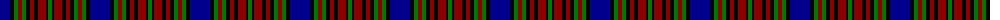

The parent of this is [Highfield (Name)](/tartans/db/20/k4/g4/dr4/g4/k4/dr4/k4/dr8/k2/g/4/)

This was sourced from tartans-authority.  It is a [11 stripes tartan](/stripes/stripes11/).

Original link http://www.tartansauthority.com/tartan-ferret/display/5186/

## Thread count
DB/20 K4 G4 DR4 G4 K4 DR4 K4 DR8 K2 G/4

## Palette
Each colour and its ΔE from the base-6 reference it is a variant of.

| Colour | Shade | Base | ΔE (OKLab) |
|---|---|---|---|
| DB |  `#00008C` | B  | 0.13 |
| DR |  `#8C0000` | R  | 0.13 |
| G |  `#007800` | G  | 0.06 |
| K |  `#000000` | K  | 0.00 |

ID: /variants/db/20/k4/g4/dr4/g4/k4/dr4/k4/dr8/k2/g/4-db00008c-dr8c0000-g007800-k000000/
