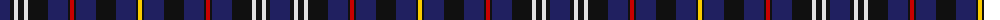

The parent of this is [City of Sarnia (District)](/tartans/db/20/k4/ln4/k6/ln4/k20/db20/k2/r4/k2/db20/k20/db20/k2/y/4/)

This was sourced from tartans-authority.  It is a [15 stripes tartan](/stripes/stripes15/).

Original link http://www.tartansauthority.com/tartan-ferret/display/10494/

## Thread count
DB/20 K4 LN4 K6 LN4 K20 DB20 K2 R4 K2 DB20 K20 DB20 K2 Y/4

## Palette
Each colour and its ΔE from the base-6 reference it is a variant of.

| Colour | Shade | Base | ΔE (OKLab) |
|---|---|---|---|
| DB |  `#202060` | B  | 0.11 |
| K |  `#101010` | K  | 0.17 |
| LN |  `#E0E0E0` | W  | 0.06 |
| R |  `#C80000` | R  | 0.00 |
| Y |  `#FCCC00` | Y  | 0.04 |

ID: /variants/db/20/k4/ln4/k6/ln4/k20/db20/k2/r4/k2/db20/k20/db20/k2/y/4-db202060-k101010-lne0e0e0-rc80000-yfccc00/
