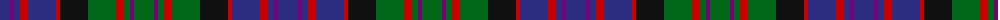

The parent of this is [MacDonald of Dunyveg Family Tartan Tartan Number: 36. Earliest known date: 1992 Designed by Captain V.J. MacDonald-Evans for himself and future Lairds of Denovan, regardless of their name. In 2009 Lord Denovan removed the restriction, to allow all Denovan's to wear it with the tartan to be called simply Denovan (rather than Lairds of Denovan). In 2010 Lord Denovan further suggested this tartan for all of the MacDonald's of Dunyveg. See products available Copyright © Blair Urquhart, Comrie, 2015](/tartans/db/20/p4/db6/r8/db28/r4/k28/g28/r8/g6/p4/g/20/)

This was sourced from house-of-tartan.  It is a [12 stripes tartan](/stripes/stripes12/).

Original link http://www.house-of-tartan.scotland.net/house/TartanViewjs.asp?colr=Def&tnam=36

## Thread count
DB/20 P4 DB6 R8 DB28 R4 K28 G28 R8 G6 P4 G/20

## Palette
Each colour and its ΔE from the base-6 reference it is a variant of.

| Colour | Shade | Base | ΔE (OKLab) |
|---|---|---|---|
| DB |  `#2C2C80` | B  | 0.05 |
| G |  `#006818` | G  | 0.02 |
| K |  `#101010` | K  | 0.17 |
| P |  `#780078` | B  | 0.16 |
| R |  `#C80000` | R  | 0.00 |

ID: /variants/db/20/p4/db6/r8/db28/r4/k28/g28/r8/g6/p4/g/20-db2c2c80-g006818-k101010-p780078-rc80000/
