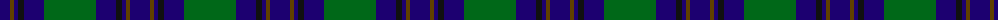
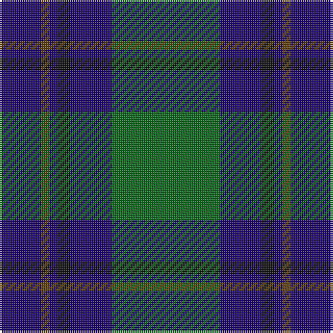

The parent of this is [St. Andrews Old Course Hotel (Corp)](/tartans/db/20/t4/db4/k6/db20/g/52/)

This was sourced from tartans-authority.  It is a [6 stripes tartan](/stripes/stripes6/).

Original link http://www.tartansauthority.com/tartan-ferret/display/2332/

## Thread count
DB/20 T4 DB4 K6 DB20 G/52

## Palette
Each colour and its ΔE from the base-6 reference it is a variant of.

| Colour | Shade | Base | ΔE (OKLab) |
|---|---|---|---|
| DB |  `#1C0070` | B  | 0.14 |
| G |  `#006818` | G  | 0.02 |
| K |  `#101010` | K  | 0.17 |
| T |  `#604000` | G  | 0.14 |

# Sample pattern

ID: /variants/db/20/t4/db4/k6/db20/g/52-db1c0070-g006818-k101010-t604000/
