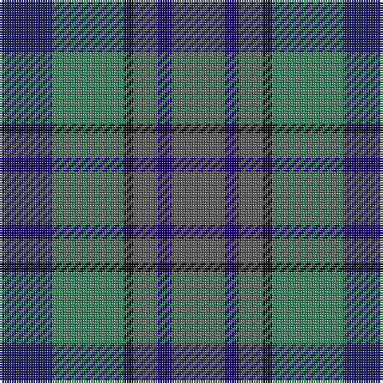

The parent of this is [Saorsa (Corporate)](/tartans/db/22/g30/k4/n10/dba6/n/22/)

This was sourced from tartans-authority.  It is a [6 stripes tartan](/stripes/stripes6/).

Original link http://www.tartansauthority.com/tartan-ferret/display/10739/

## Thread count
DB/22 G30 K4 N10 DBa6 N/22

## Palette
Each colour and its ΔE from the base-6 reference it is a variant of.

| Colour | Shade | Base | ΔE (OKLab) |
|---|---|---|---|
| DB |  `#202060` | B  | 0.11 |
| DBa |  `#1C0070` | B  | 0.14 |
| G |  `#408060` | G  | 0.13 |
| K |  `#101010` | K  | 0.17 |
| N |  `#5C5C5C` | B  | 0.14 |

# Sample pattern

ID: /variants/db/22/g30/k4/n10/dba6/n/22-db202060-dba1c0070-g408060-k101010-n5c5c5c/
