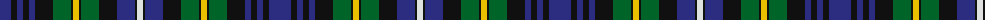

The parent of this is [Glengoyne Distillery Corporate Tartan Tartan Number: 1144. Earliest known date: 1993 Designed for the Glengoyne Distillery by Lochcarron of Scotland in 1993. See products available Copyright © Blair Urquhart, Comrie, 2015](/tartans/db/22/k6/db6/k6/db6/k18/g18/k2/y6/k2/g18/k18/db18/k2/ln/6/)

This was sourced from house-of-tartan.  It is a [15 stripes tartan](/stripes/stripes15/).

Original link http://www.house-of-tartan.scotland.net/house/TartanViewjs.asp?colr=Def&tnam=1144

## Thread count
DB/22 K6 DB6 K6 DB6 K18 G18 K2 Y6 K2 G18 K18 DB18 K2 LN/6

## Palette
Each colour and its ΔE from the base-6 reference it is a variant of.

| Colour | Shade | Base | ΔE (OKLab) |
|---|---|---|---|
| DB |  `#2C2C80` | B  | 0.05 |
| G |  `#006428` | G  | 0.03 |
| K |  `#101010` | K  | 0.17 |
| LN |  `#E0E0E0` | W  | 0.06 |
| Y |  `#E8C000` | Y  | 0.00 |

ID: /variants/db/22/k6/db6/k6/db6/k18/g18/k2/y6/k2/g18/k18/db18/k2/ln/6-db2c2c80-g006428-k101010-lne0e0e0-ye8c000/
