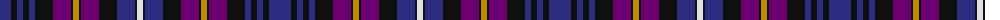

The parent of this is [Glengoyne Distillery (Corporate)](/tartans/db/22/k6/db6/k6/db6/k18/p18/k2/dy6/k2/p18/k18/db18/k2/ln/6/)

This was sourced from tartans-authority.  It is a [15 stripes tartan](/stripes/stripes15/).

Original link http://www.tartansauthority.com/tartan-ferret/display/1144/

## Thread count
DB/22 K6 DB6 K6 DB6 K18 P18 K2 DY6 K2 P18 K18 DB18 K2 LN/6

## Palette
Each colour and its ΔE from the base-6 reference it is a variant of.

| Colour | Shade | Base | ΔE (OKLab) |
|---|---|---|---|
| DB |  `#2C2C80` | B  | 0.05 |
| DY |  `#BC8C00` | Y  | 0.16 |
| K |  `#101010` | K  | 0.17 |
| LN |  `#E0E0E0` | W  | 0.06 |
| P |  `#6C0070` | B  | 0.15 |

ID: /variants/db/22/k6/db6/k6/db6/k18/p18/k2/dy6/k2/p18/k18/db18/k2/ln/6-db2c2c80-dybc8c00-k101010-lne0e0e0-p6c0070/
